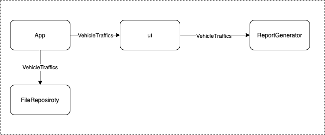
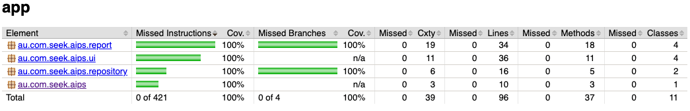

## Traffic analyser

## Design thoughts

Vehicle traffic information is used to generate various form of reports

Separation of concern preserved by keeping ui and report generator in separate package And multiple
ui & report has its own purpose and independent of each other. File repository is simplified for
now, which can be extended for other sources

### Assumptions & Tradeoffs

* ISO Dates used, not considered for any timezones for simplicity
* Displayed output in console
* Displayed 3 contiguous records containing least amount of traffic without sum
* All the data read from file and kept in memory to keep it simple

### Code coverage

Entity objects are excluded from the report.

### Prerequisite

* Java 15,
* IDE (optional)
* gradle (depends)

## How to use?

### Setup

* Intellij
    * File > New > Project from Existing Sources... > navigate & choose settings.gradle

### Run Test and code coverage check

* Navigate inside project directory
* Simple
  > `./gradlew clean build` or `./gradlew clean test jacocoTestReport`
* generate jacoco report
  > ./gradlew jacocoTestReport

### Run Application

if maven and java15 are available in machine
<blockquote>
./gradlew run or gradle run
</blockquote>
otherwise (using docker)  
<blockquote>
docker run -v "$PWD:/home" -w /home -it gradle:jdk16 gradle run
</blockquote>

#### Customize input

By default, it uses input files from test resources, it can be overridden by environment variables
Variable names

* `INPUT_FILE` for file location with path and name e.g `export INPUT_FILE=/home/sample.txt`  
  _Note_: if `INPUT_FILE` is not provided it will use `src/test/resources/traffic_count.txt` value
  to create square board size clear environment variable at any time

<blockquote>
unset INPUT_FILE
</blockquote>

##### Run application

if maven and java15 are available in machine  
Input file can be mentioned using absolute path(`/Users/xxx/yyy.txt`)
<blockquote>
export INPUT_FILE=/Users/xxx/yyy.txt && ./gradlew run
</blockquote>

otherwise (using docker)  
current working directory is mounted as `/home`, probably easy way to give custom input file is
copying into source code location and path can be provided as environment variable

<blockquote>
docker run --env INPUT_FILE=/home/app/src/test/resources/traffic_count.txt -v "$PWD:/home" -w /home -it gradle:jdk16 gradle run
</blockquote>
